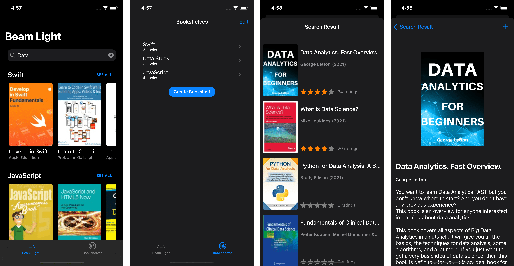

  

Beam-Light
==================
An iOS app that lets you search for books from iTunes API and create your own bookshelves to manage your saved books.
<b>Note:</b> This is a personal project for learning propose.

## Application details

### Main features
The app make use of the iTunes search API to search books and save your book/bookshelf using a local disk storage service.

### Dependency
The app use [SDWebImage](https://github.com/SDWebImage/SDWebImage) for image download and caching.
The app use [Swinject](https://github.com/Swinject/Swinject) for DI solution.
